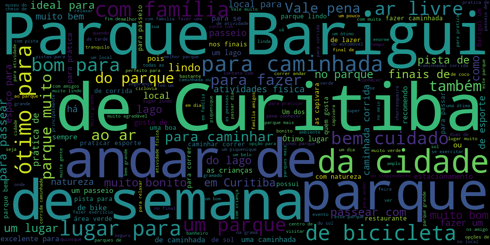

# Python WebScraping

A Python web scraping project with WordCloud graphic

### Installing

To install virtualenvwrapper
```
$ sudo pip install virtualenvwrapper
$ sudo gedit ~/.bashrc or ~/.zshrc

Add this piece of code in the end of file and reopen the terminal:

$ export WORKON_HOME=$HOME/.virtualenvs
$ source /usr/local/bin/virtualenvwrapper.sh
```

To install requirements
```
$ mkvirtualenv web-scraping --python=python3
$ workon web-scraping
$ pip3 install -r requirements.txt
```

Running the crawler
```
$ cd tripadvisor
$ cd tripadvisor

To export to JSON
$ scrapy crawl trip_comments -o tripadvisor.json

To export to CSV
$ scrapy crawl trip_comments -o tripadvisor.csv
```
Running the WordCloud generator
```
To craw and create the WordCloud image run the script:
$ python main.py

To create the WordCloud image only:
$ python word_cloud.py
```
It will give you an image similar to this:

